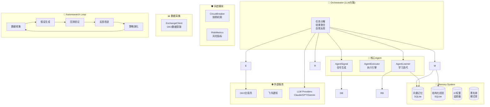

> ⚠️ **风险提示 / Risk Disclaimer**
> 本系统为**学习与仿真用途**，任何实盘使用需自行承担风险。
> 本仓库不构成投资建议，作者不对使用本代码造成的任何损失负责。
> Trading involves risk. Use only for educational/simulation purposes.

# Miracle 2.0 — 自主学习量化交易系统

**版本**: 2.0
**定位**: 大语言模型 + 多Agent协同的自主学习交易系统
**核心理念**: 赔率优先 + LLM驱动的自适应学习 + Autoresearch持续进化

---

## 系统架构图



详细架构文档见 [docs/ARCHITECTURE.md](docs/ARCHITECTURE.md)

---

## 核心能力

| 能力 | 1.0 | 2.0 |
|------|------|------|
| 学习触发 | 固定周期 | 每笔交易后即时学习 |
| 因子调整 | IC阈值规则 | LLM分析因果 |
| 模式发现 | 简单统计 | LLM语义聚类 |
| 策略演化 | 月度淘汰 | 持续进化 |
| 知识积累 | 规则存储 | 向量记忆检索 |

### 多Agent协同

| Agent | 职责 | 实际模块 |
|-------|------|---------|
| **Orchestrator** | 全局规划、决策 | `scripts/miracle_kronos.py::run_scan()` |
| **ExchangeClient** | 市场数据采集 | `core/exchange_client.py` |
| **AgentSignal** | 信号生成、因子融合 | `agents/agent_signal.py` |
| **CircuitBreaker** | 风险管理、熔断 | `core/circuit_breaker.py` |
| **AgentExecutor** | OKX下单执行 | `agents/agent_executor.py` |
| **AgentLearner** | 学习迭代、策略演化 | `agents/agent_learner.py` |

> 注：Agent-M（市场情报）和Agent-R（风险管理）已内化为 `ExchangeClient` 和 `CircuitBreaker` 模块，而非独立Agent进程。

---

## 快速开始

### 安装依赖

```bash
cd ~/miracle_system
pip install -r requirements.txt

# 可选：ChromaDB（向量记忆）
pip install chromadb
```

### 基本使用

```python
from miracle_autonomous import MiracleAutonomous

# 初始化系统
system = MiracleAutonomous(
    symbols=["BTC", "ETH", "SOL", "DOGE"],
    mode="simulation"
)

# 运行自主研究循环
system.run_autonomous_cycle(experiments=50)

# 做交易决策
decision = system.make_decision(market_data)
```

### 命令行使用

```bash
# 运行完整自主研究
python miracle_autonomous.py --experiments 50 --coins BTC,ETH,SOL,DOGE

# 仅做决策
python miracle.py --symbol BTC

# 查看Pilot驾驶舱
python miracle_pilot.py --full
```

---

## 目录结构

```
miracle_system/
├── miracle.py                    # 主入口
├── miracle_autonomous.py         # 自主学习入口
├── miracle_core.py               # 核心计算
├── miracle_pilot.py              # 驾驶舱
├── miracle_kronos.py             # Kronos兼容
├── backtest.py                  # 回测引擎
│
├── core/                        # 核心模块
│   ├── orchestrator.py         # 协调器（LLM大脑）
│   ├── llm_provider.py         # LLM接口
│   ├── ic_weights.py            # IC动态权重
│   ├── regime_classifier.py     # 市场状态分类
│   ├── state_reconciler.py      # OKX状态同步
│   ├── feishu_notifier.py       # 飞书通知
│   ├── circuit_breaker.py        # 熔断机制
│   ├── executor_config.py        # 执行器配置
│   ├── secure_key_manager.py     # 密钥管理
│   ├── slippage_monitor.py       # 滑点监控
│   ├── trade_logger.py           # 交易日志
│   ├── executor_feishu_notifier.py # 执行引擎通知
│   └── memory/                   # 记忆系统
│
├── agents/                      # Agent模块
│   ├── agent_market_intel.py     # 市场情报
│   ├── agent_market_intel_llm.py # 市场情报LLM增强
│   ├── agent_signal.py           # 信号生成
│   ├── agent_risk.py             # 风险管理
│   ├── agent_executor.py         # 执行引擎
│   ├── agent_learner.py          # 学习迭代
│   └── agent_coordinator.py      # 协调器
│
├── models/                     # 模型相关
├── adaptive_learner.py          # 自适应学习
├── coin_optimizer.py            # 每币种参数优化
├── tests/                      # 测试
│   ├── test_circuit_breaker.py
│   ├── test_agent_signal.py
│   ├── test_risk_management.py
│   └── test_ic_weights.py
├── docs/                       # 详细文档
│   ├── ARCHITECTURE.md          # 架构设计详细文档
│   └── DEVELOPMENT.md           # 开发指南
├── requirements.txt              # 运行时依赖
├── requirements-dev.txt          # 开发依赖
├── pyproject.toml               # 项目配置
└── README.md
```

---

## 配置

### 环境变量

```bash
# LLM API Keys
export ANTHROPIC_API_KEY=sk-ant-...     # Claude
export OPENAI_API_KEY=sk-...             # GPT
export GOOGLE_API_KEY=...                 # Gemini
export DEEPSEEK_API_KEY=sk-...           # DeepSeek

# OKX API
export OKX_API_KEY=...
export OKX_SECRET_KEY=...
export OKX_PASSPHRASE=...

# 飞书通知
export FEISHU_WEBHOOK_URL=https://open.feishu.cn/...
```

### 配置文件

```json
{
  "symbols": ["BTC", "ETH", "SOL", "DOGE", "BNB", "XRP", "ADA", "AVAX", "DOT", "LINK"],
  "min_rr": 2.0,
  "min_confidence": 0.6,
  "max_trades_per_day": 5,
  "max_position_pct": 15,
  "leverage": 3,
  "llm_provider": "claude",
  "enable_autoresearch": true,
  "enable_memory": true
}
```

---

## 与Kronos对比

| 维度 | Kronos | Miracle 2.0 |
|------|--------|-------------|
| **学习方式** | IC权重规则 | LLM驱动的自主学习 |
| **信号生成** | 固定公式 | LLM推理 + 动态权重 |
| **知识积累** | JSON文件 | ChromaDB向量记忆 |
| **策略演化** | 定期淘汰 | Autoresearch持续进化 |
| **反思能力** | 有限 | 每笔交易即时反思 |
| **多Agent** | 3 Agent | AgentSignal + AgentExecutor + AgentLearner |

---

## 功能状态

| 功能 | 状态 | 说明 |
|------|------|------|
| Orchestrator | ✅ | `run_scan()` + LLM降级规则 |
| LLM Provider | ✅ | Claude/GPT/Gemini/DeepSeek |
| Memory System | ✅ | SQLite + IC权重追踪 + 遗忘机制 |
| ExchangeClient | ✅ | OKX数据获取 |
| AgentSignal | ✅ | 信号生成 + 多因子融合 |
| CircuitBreaker | ✅ | 五级熔断机制 |
| AgentExecutor | ✅ | OKX下单 + 动态止损 |
| AgentLearner | ✅ | IC权重更新 + 模式黑名单 |
| Autoresearch Loop | ✅ | Keep/Discard淘汰 |
| OKX集成 | ✅ | 模拟盘+实盘 |
| 飞书通知 | ✅ | 分级告警 |
| 单元测试 | ✅ | 337个测试覆盖核心模块 |
| ChromaDB向量记忆 | ⚠️ | 已切换为SQLite，Roadmap预留 |

---

## 开发指南

详细文档见 [docs/DEVELOPMENT.md](docs/DEVELOPMENT.md)

### 添加新的Agent

```python
from agents.base_agent import BaseAgent

class MyAgent(BaseAgent):
    async def execute(self, context):
        return {"result": "..."}
```

### 运行测试

```bash
# 全部测试
python -m pytest tests/ -v

# 单模块测试
python -m pytest tests/test_circuit_breaker.py -v
```

---

## 许可证

MIT License

---

**赔率优先，永不妥协。**
